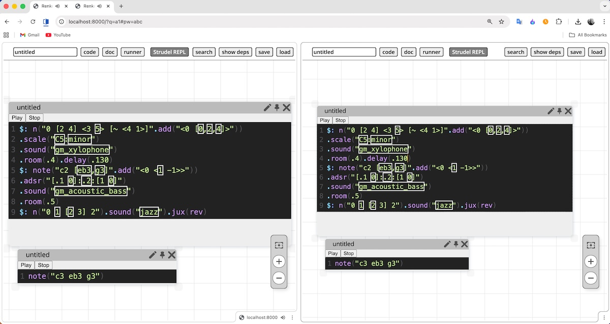
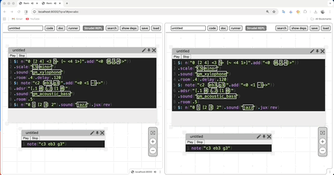

# Musical Collaborative Pad

**Musical Collaborative Pad** is an open-source project aiming creating live collaborative environment running within Web Browser/NodeJS for creating musical collaborative instruments and performing with them online.  
Based on [Renkon-Pad & Croquet](https://github.com/yoshikiohshima/renkon-pad) and [Strudel](https://codeberg.org/uzu/strudel)  

#### Live demo at https://pad.krestianstvo.org

</img>

## Development status (WIP)

- Strudel Lib is loaded inside Renkon-Pad and fully playable
- Strudel's CodeMirror is modifed for using Croquetified CodeMirror from Renkon-Pad
- All Strudel REPL's code windows are multiplayer by default suitable for live coding together
- Play & Stop buttons are shared too
- Saving & Restoring of Strudel REPLs in pads is working

</img>

### Run & Develop

The easiest way to run the pad is to use the ```dev``` branch of this repository, which contains the full distribution of the [Renkon-Pad](https://github.com/yoshikiohshima/renkon-pad) with merged Musical Collaborative Pad files.     

The ```main``` branch of this repository contains only Musical Collaborative Pad related files and those that touch the original Renkon-Pad. You can place & merge them into any other Renkon-Pad distribution on your own.   

To run

```node server.js```

**Note**: For local development the [Croquet in a box](https://github.com/croquet/croquet) could be used.